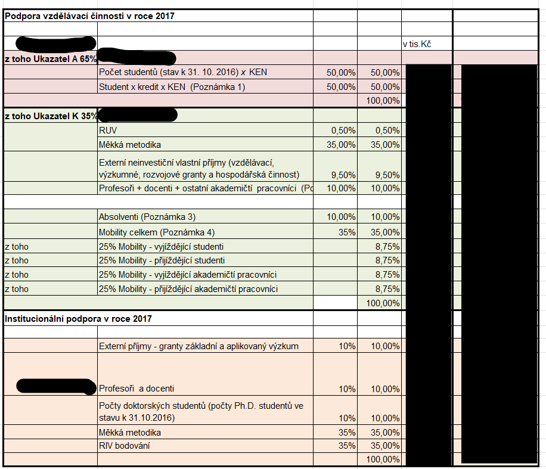
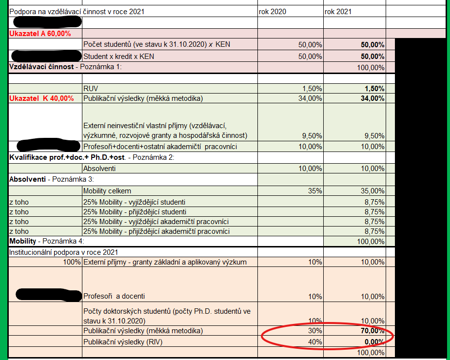
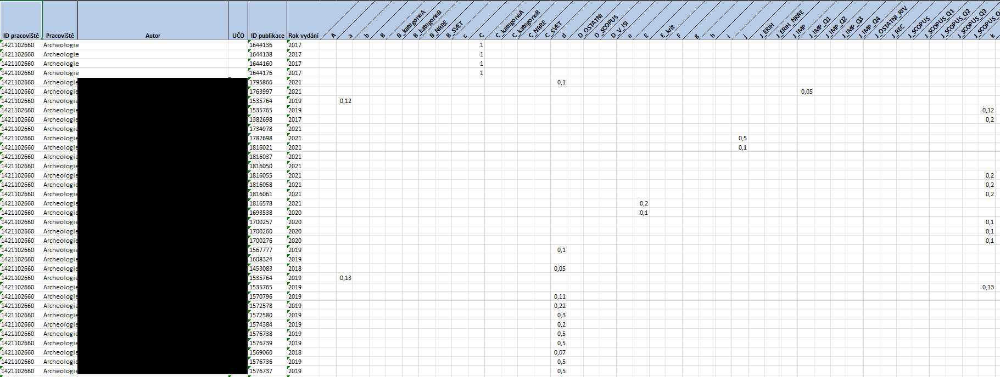
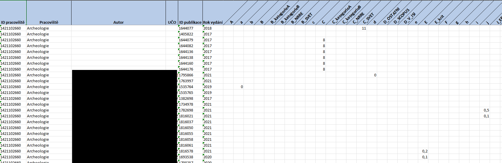
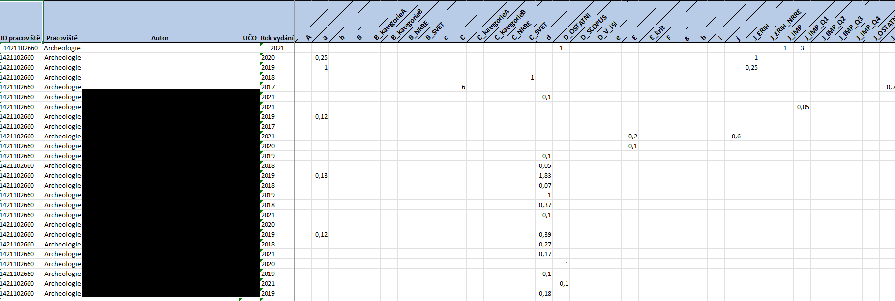
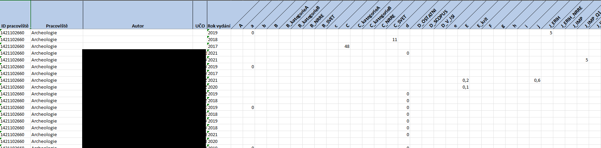
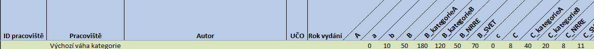
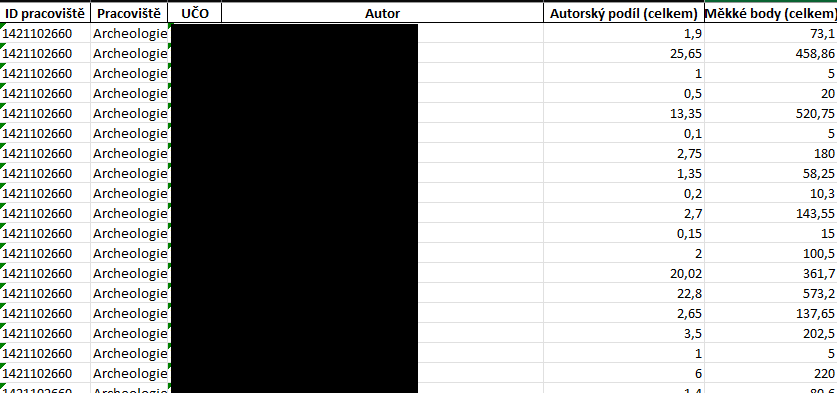
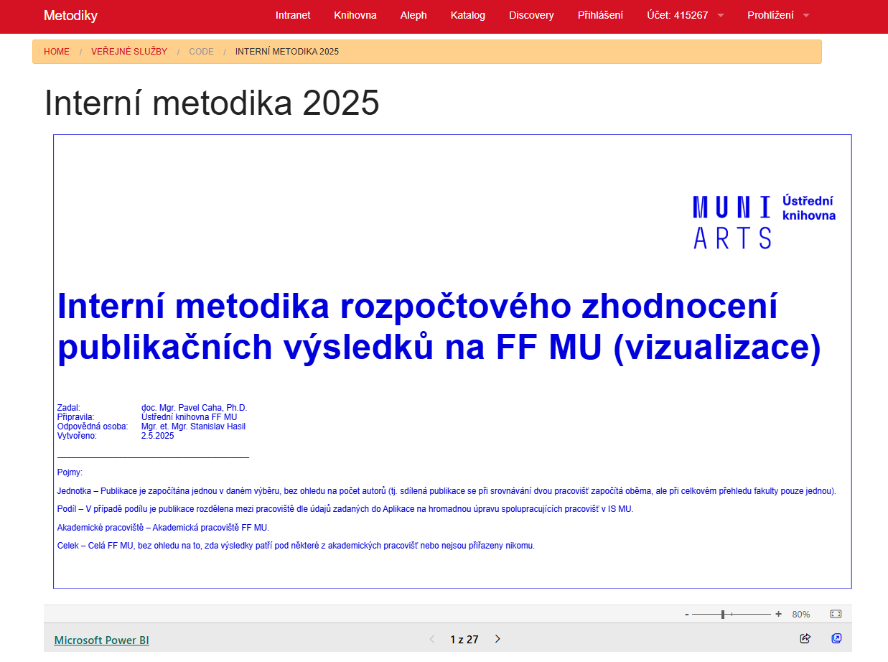

```{r setup, include=FALSE}
knitr::opts_chunk$set(echo = FALSE)
library(ggplot2)
library(dplyr)
library(tidyr)
library(xaringan)
```

##Problem:
- Data is currently being produced in huge quantities.
- Researchers don't have the time to monitor it all on top of their own research.
- To get relevant insight into data about the research landscape, one must be able to look at multiple research fields at once; deep insight into one field may cloud one's judgment about others (e.g., science vs humanities).

##Solution:
- A specialized administrative department dedicated to monitoring the research landscape at the desired levels.
- Why create a new one when you have a department dedicated to hoarding and organizing research results with people who know how to work with large volumes of data, extract relevant information from it, etc.?

---
##History of research assesment on Faculty of Arts, MU
*No system comes to being in it's fullest from nothing.*
###Pre-history:
RIV points, so-called "Hard methodology"
- Until 2017, there was a nationwide research assessment system based on points given to publications.
- It was criticized for not differentiating between some subtypes of results.
- Dean (responsible vice-dean), in cooperation with the faculty senate, implemented a complementary inner faculty system, so-called "Soft methodology".
---

---
##History of research assesment on Faculty of Arts, MU
*No system comes to being in it's fullest from nothing.*
###Only methodology:
- In 2021, the Hard methodology (finaly) ended (after being discontinued on national level in 2017), and the Soft, now called Inner methodology, became the sole system for distributing money per research results (mostly publications, but not only publications).

---



---
##History of research assesment on Facoulty of Arts, MU
- 2021 is the year the Central Library took over the publication data preparation for the Bursar.
- It was one of the final stages of a long process of the library taking over the responsibility for bibliometrics and proofreading of metadata records for national evidence (RIV).
- We soon realized we were putting much effort into preparing and processing data. The result is an overview table for the entire faculty and separate datasets with four sheets for department heads. And not using the whole final dataset.
  - We can't make it more efficient by doing less, because we need the final data.
  - We can improve our work with the data to make it more readable and relevant for management. In other words, get our time and work investment back in other ways.

---
##Starting point
###Four sheets in each department dataset
- Autorské podíly (publikace) | Author's shares (publications)
- Měkké body (publikace) | Soft Points (publication)
- Autorské podíly (celkem) | Author's shares (total)
- Měkké body (celkem) | Soft points (total)

---
####Autorské podíly (publikace) | Author's shares (publications)

---
####Měkké body (publikace) | Soft Points (publication)

---
####Autorské podíly (celkem) | Author's shares (total)

---
####Měkké body (celkem) | Soft points (total)

---
##First changes
- Adding a line with an info about max point in cathegory.<p>


- New sheet: **Přehled dle autorů | Overview by authors**<p>


---
##First Power BI experiments
###On demand for departmens
- A few of the department heads asked for more digestible materials. They probably imagined an Excel workbook with a few charts and a Word document with the mentioned charts and commentaries. Instead, we offered them small department-focused Power BI dashboards with information we could provide in a Word document if they wanted one. No one asked for a Word document. Instead, a few of them asked us to come to the department meeting and show and explain the dashboard.
- Consisted of:
  - Title slide with legend
  - Overview with authors and numbers of results
  - Overview with authors participation on results
  - Changes in time

---
##First Power BI experiments
###For new faculty managment
- After our current dean took office, she wanted to get some insights into the faculty research landscape. We prepared a Power BI dashboard similar to the departmental ones for the whole faculty, a little bigger, but anonymized.
- She expected a Word document with highlights, similar to those about other agendas. She was pleasantly surprised because she could change her focus to individual departments, groups of departments, and kinds of publications and see year-by-year development. Afterwards, she started asking for dashboards focused on specific issues (e.g., results of PhD students and their part in overall faculty productivity).

---
##Power BI now
.center[


<a href="https://app.powerbi.com/groups/me/reports/5548e34f-cb9c-4e87-8cc7-314311f9741d/ReportSectionc54d61d33a3d62fd55be?experience=power-bi">**Power BI of Inner methodology of Facoulty of Arts, 2020-2024**</a>
<p>*Current version has more than 20 pages*]
---
##What's next – quarterly reports and other ideas
###Implemented during 2025
- Quaterly reports based on department datasets with newly entered results and information about expected value in IM points.
- 5-year-long report on the Q development of journals in SJR.

###Currently under considiration
- Combining reports for the departments with results from the National evaluation.
---
##Any questions?

---

#Thank you for your attention!

.center[
Mgr. et Mgr. Stanislav Hasil | [Central Library of the Faculty of Arts](https://knihovna.phil.muni.cz/en)
]
.center[
<a href="mailto:stanislav.hasil@phil.muni.cz">stanislav.hasil@phil.muni.cz</a> | <a href="mailto:bibliometrie@phil.muni.cz">bibliometrie@phil.muni.cz</a>
]
.center[

]

```{r}

```

